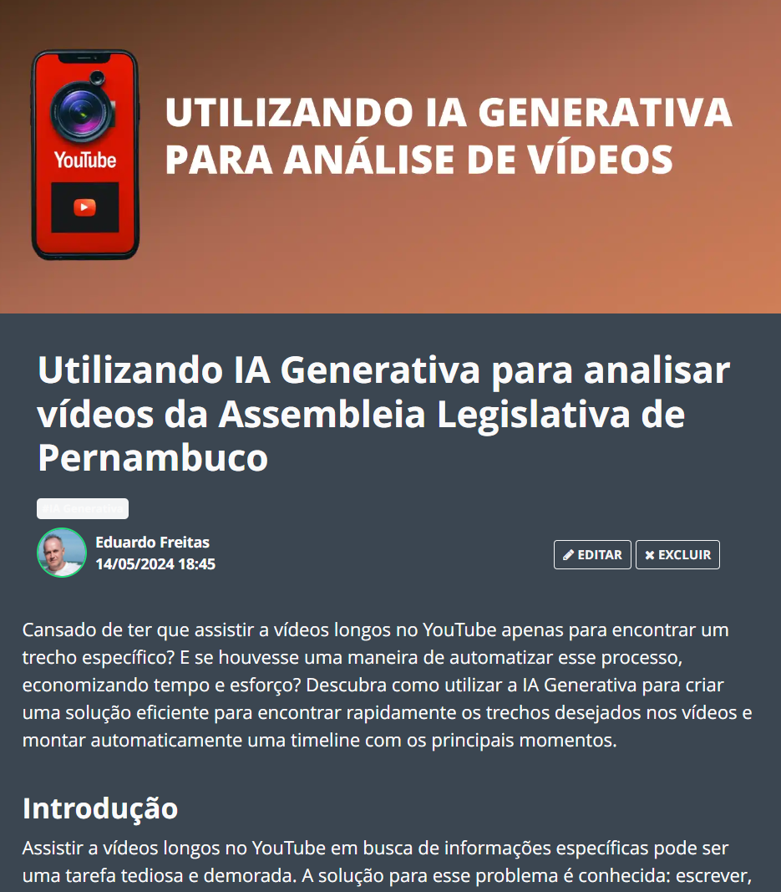

    

  
  

-------

  

# Projeto artigo técnico com auxílio de I.A.s

 > ℹ️ **NOTE:** Este é o repositório desenvolvido durante o curso no qual fui aluno na plataforma da [DIO](https://dio.me).

  

Projeto com o objetivo de gerar um artigo técnico com um layout rico, leitura agradável e com foco em promover autoridade técnica.

<a href="https://web.dio.me/articles/utilizando-ia-generativa-para-analisar-videos-da-assembleia-legislativa-de-pernambuco" title="View PDF now"> 📕Clique aqui para ler o artigo</a>

## 💻 Tecnologias utilizadas no projeto

- [ChatGPT](https://chat.openai.com/) - para título e ajustes no conteúdo
- [Lexica.art](https://lexica.art/) - para gerar imagens
- [PowerPoint](https://www.microsoft.com/en/microsoft-365/powerpoint) - Para formatação de banners e Layouts

## 📄 Prompts e ferramentas

ChatGPT：

|   Ação   | prompt                                                                                                                                                                                                                                                                         |
| :------: | ------------------------------------------------------------------------------------------------------------------------------------------------------------------------------------------------------------------------------------------------------------------------------ |
|  título  | tenho um projeto publicado no github e gostaria de escrever um artigo sobre ele. O nome do projeto é YouTubeClipper, que é um ferramenta em Python para extrair informações sobre vídeos do YouTube                                                                                                                                                                                                    |
| conteúdo | seria interessante agora definir os subtítulos do artigo. o que vc sugere? |

Copilot：

- No copilot  utilizamos o acervo público de imagens geradas por outras pessoas. Os termos de pesquisa que utilizei durante a gravação do conteúdo foram:

• YouTube

## ✨ Features

- Conteúdo gerado por humano e ajustado via ChatGPT
- Imagens do acervo público geradas via Lexica.art

## 📚 Materiais

- prompts utilizados

## 🛠️ Instruções de execução

Utilize os prompts acima nas ferramentas sugeridas para gerar o material base e utilize uma ferramenta de edição de documentos como power point, libreoffice, indesign para diagramação.

## 👨‍💻 Expert

    
    
&nbsp&nbsp&nbspEduardo Freitas 
    &nbsp&nbsp&nbsp
    <a href="https://github.com/eduardoboca">
    GitHub</a>&nbsp;|&nbsp;
    <a href="https://www.linkedin.com/in/eduardo-freitas-ehff/">LinkedIn</a>
&nbsp;|&nbsp;

  

---

por [Eduardo Freitas](https://github.com/eduardoboca)
